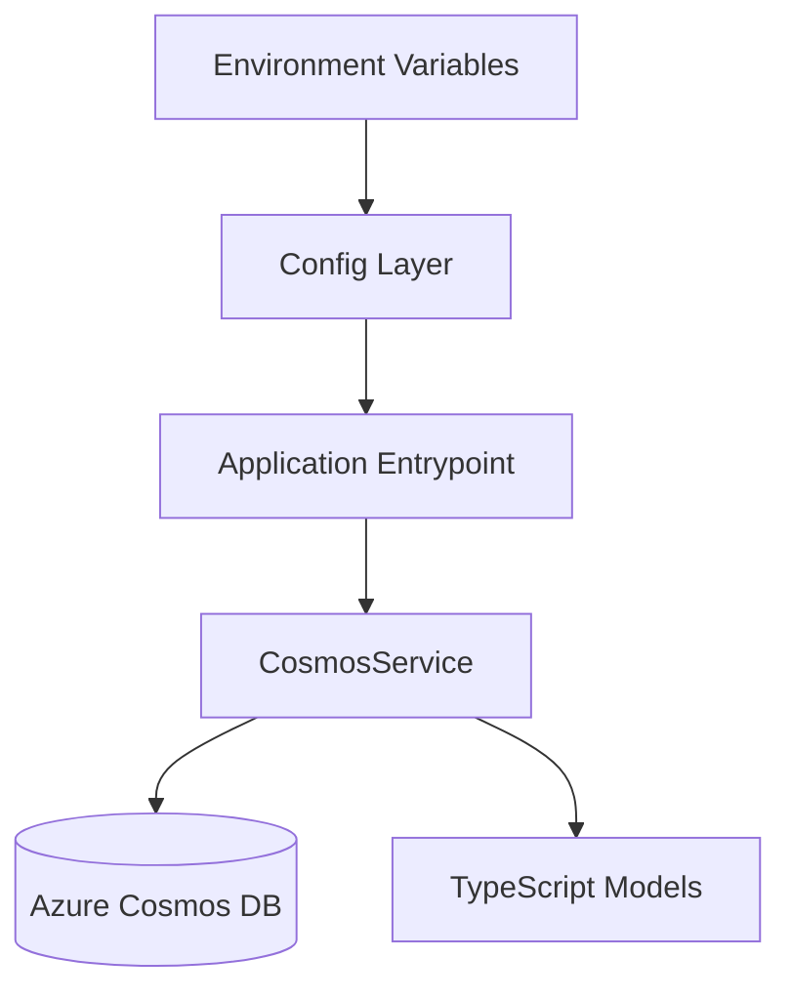

# AI Coach Architecture Overview

AI Coach is a lightweight TypeScript application organized around configuration, a Cosmos DB service layer, and shared document types. The current implementation is intentionally small, making it easy to extend toward richer coaching workflows over time.

## High-Level System Diagram

## Component Breakdown

### Config Layer

The config layer lives in `src/config/index.ts` and is responsible for:

- loading `.env` values with `dotenv`
- validating required settings such as `COSMOS_ENDPOINT` and `COSMOS_KEY`
- building the `AppConfig` object used by the rest of the app

### Service Layer (Cosmos DB)

The service layer lives in `src/services/cosmos.ts` and exposes `CosmosService`, which handles:

- constructing the Azure Cosmos DB client
- creating the database if it does not already exist
- creating the target container if it does not already exist
- CRUD operations for stored documents
- SQL-style queries through the Cosmos SDK

### Types and Models

The shared types live in `src/types/index.ts` and currently define:

- `CosmosConfig` for database connection settings
- `BaseDocument` for shared document metadata
- `AppConfig` for top-level runtime configuration

These types keep the configuration and persistence contracts consistent as AI Coach grows.

## Data Flow

1. AI Coach starts from `src/index.ts`
2. The config layer reads environment variables and creates `config`
3. Application code instantiates `CosmosService` with `config.cosmos`
4. `initialize()` ensures the configured database and container exist
5. Feature code performs create, read, update, delete, or query operations through the service
6. Typed documents are returned to the caller for further coaching logic or presentation

## Cosmos DB Data Model

### Current implementation

The current service initialization creates:

- **Database:** value from `COSMOS_DATABASE_NAME` (default `ai-coach`)
- **Container:** `documents` by default
- **Partition key:** `/id` by default

These defaults come from `CosmosService.initialize()` and work well for early-stage development and generic document storage.

### Product-oriented container strategy

As AI Coach expands into a fuller coaching platform, a more domain-specific model is recommended:

| Container          | Purpose                                             | Suggested partition key |
| ------------------ | --------------------------------------------------- | ----------------------- |
| `profiles`         | user profile and coaching preference documents      | `/id`                   |
| `goals`            | active and completed coaching goals                 | `/userId`               |
| `coachingSessions` | AI-generated coaching session summaries and prompts | `/userId`               |
| `progressRecords`  | skill progress snapshots and milestone updates      | `/userId`               |

## Design Decisions and Rationale

### Centralized configuration

AI Coach keeps all environment handling in one place so feature code does not need to know how secrets or runtime settings are loaded.

### Thin database abstraction

`CosmosService` provides a small, focused API over the Azure SDK. This keeps the application easier to test and reduces repeated Cosmos setup logic.

### TypeScript-first contracts

The project uses TypeScript interfaces for configuration and stored documents so data access patterns stay explicit and maintainable.

## Future Architecture Considerations

Potential next steps for AI Coach include:

- adding domain-specific repositories on top of `CosmosService`
- introducing separate models for goals, sessions, and progress tracking
- expanding the application entrypoint into API or worker processes
- adding observability around Cosmos DB latency and query costs
- using environment-specific containers or databases for dev, test, and production isolation

## Related Documentation

- [Getting Started](getting-started.md)
- [API Reference](api-reference.md)
- [Development Guide](development-guide.md)
- [Security Practices](security-practices.md)
